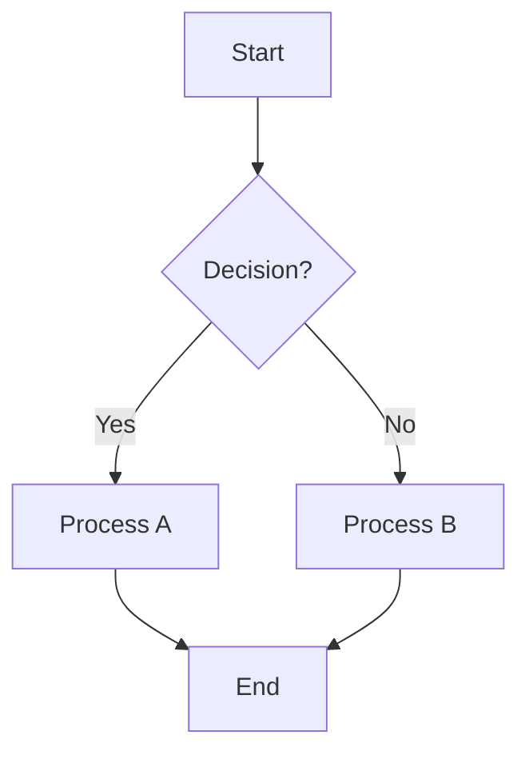

# 🌊 Mermaid GUI v2.0

> **Privacy-first, offline-capable Mermaid diagram generator for developers**

[](https://www.gnu.org/licenses/gpl-3.0)

[](https://tauri.app/)
[](https://svelte.dev/)
[](https://www.rust-lang.org/)

<!-- Stats -->


<!-- Features -->


A modern, native desktop application for creating and editing Mermaid diagrams with real-time preview, Monaco editor integration, and powerful batch processing capabilities.

## ✨ Features

### 🔐 **Privacy-First Design**
- **100% Offline Operation** - No internet required, no data leaves your machine
- **Local File Processing** - All diagrams stay on your computer
- **Zero Telemetry** - We don't track you, period

### ⚡ **Developer Experience**
- **Monaco Editor** - Full-featured code editor with syntax highlighting
- **Live Preview** - Real-time diagram preview with error detection
- **Smart Debouncing** - Efficient preview updates without performance hits
- **Keyboard Shortcuts** - Vim-like efficiency with modern UX

### 🎨 **Modern Interface**
- **Split-Panel Layout** - Resizable editor and preview panes
- **Dark/Light Themes** - Easy on the eyes, day or night
- **Responsive Design** - Adapts to different screen sizes
- **Professional UI** - Clean, intuitive interface

### 🚀 **Power Features**
- **Multiple Export Formats** - PNG, SVG, PDF, JPG
- **Batch Processing** - Process multiple diagrams at once
- **Recent Files** - Quick access to your work
- **Error Handling** - Helpful error messages and recovery

## 📸 Screenshots

### Dark Theme with Live Preview


## 🚀 Quick Start

### Prerequisites

1. **Install Mermaid CLI** (required for diagram generation):
   ```bash
   npm install -g @mermaid-js/mermaid-cli
   ```

2. **System Requirements**:
   - **Linux**: Ubuntu 20.04+ / Fedora 35+ / Arch Linux
   - **macOS**: 10.15+ (Intel/Apple Silicon)
   - **Windows**: 10+ (x64)

### Installation

#### Option 1: Download Release Binary
1. Go to [Releases](https://github.com/baris-sinapli/mermaid-diagram/releases)
2. Download the appropriate binary for your platform
3. Run the installer or extract the archive

#### Option 2: Build from Source
```bash
# Clone the repository
git clone https://github.com/baris-sinapli/mermaid-diagram.git
cd mermaid-gui-v2

# Install dependencies
npm install

# Run in development mode
npm run tauri dev

# Or build for production
npm run tauri build
```

## 🎯 Usage

### Basic Usage

1. **Launch the application**
2. **Start typing** Mermaid code in the left panel
3. **Watch the preview** update in real-time on the right
4. **Generate diagrams** with `Ctrl+E` or the Generate button

### Keyboard Shortcuts

| Shortcut | Action |
|----------|--------|
| `Ctrl+N` | New file |
| `Ctrl+O` | Open file |
| `Ctrl+S` | Save file |
| `Ctrl+E` | Generate diagram |
| `Ctrl+F` | Find & replace |

### Supported Diagram Types

- **Flowcharts** (`graph` / `flowchart`)
- **Sequence Diagrams** (`sequenceDiagram`)
- **Class Diagrams** (`classDiagram`)
- **State Diagrams** (`stateDiagram`)
- **Gantt Charts** (`gantt`)
- **Pie Charts** (`pie`)
- **Git Graphs** (`gitgraph`)
- **And more!**

### Example Mermaid Code



## 🏗️ Architecture

### Technology Stack

- **Frontend**: SvelteKit + TypeScript
- **Backend**: Rust + Tauri 2.0
- **Editor**: Monaco Editor with custom Mermaid syntax
- **Diagram Engine**: Mermaid CLI (mmdc)
- **Styling**: Custom CSS with CSS Variables

### Project Structure

```
mermaid-gui-v2/
├── src/                    # Frontend (SvelteKit)
│   ├── lib/
│   │   ├── components/     # UI components
│   │   ├── services/       # Business logic
│   │   ├── stores/         # State management
│   │   ├── styles/         # CSS styles
│   │   └── utils/          # Helper functions
│   └── routes/             # SvelteKit routes
├── src-tauri/              # Backend (Rust)
│   ├── src/
│   │   ├── commands/       # Tauri commands
│   │   ├── models/         # Data structures
│   │   ├── services/       # Core services
│   │   └── utils/          # Utilities
│   └── Cargo.toml
├── static/                 # Static assets
└── docs/                   # Documentation
```
## 🛡️ Security & Privacy

### 🔐 Data Protection
- **Zero Data Collection** - We don't collect any personal information
- **Local Storage Only** - All files remain on your computer
- **No Network Requests** - Application works completely offline
- **No Telemetry** - No usage analytics or crash reporting

### 🛡️ Security Features
- **Sandboxed Execution** - Tauri security model
- **Memory Safe** - Written in Rust for memory safety
- **No Arbitrary Code Execution** - Safe diagram processing
- **Regular Security Audits** - Community-driven security reviews

### 📋 Privacy Compliance
- ✅ **GDPR Compliant** - No data processing
- ✅ **CCPA Compliant** - No personal information collection
- ✅ **SOC 2 Ready** - Enterprise security standards
- ✅ **Open Source Transparency** - Full code visibility

## 🔄 Comparison with Alternatives

| Feature | Mermaid GUI v2.0 | Mermaid Live | VS Code + Extensions | Draw.io |
|---------|------------------|---------------|---------------------|---------|
| **Offline Support** | ✅ Yes | ❌ Online only | ✅ Yes | ⚠️ Limited |
| **Privacy** | ✅ Complete | ❌ Data sent to servers | ✅ Local | ⚠️ Google owned |
| **Live Preview** | ✅ Real-time | ✅ Real-time | ⚠️ Extension dependent | ❌ No |
| **Batch Processing** | ✅ Built-in | ❌ No | ❌ No | ❌ No |
| **Native Performance** | ✅ Tauri/Rust | ❌ Web app | ⚠️ Electron | ❌ Web app |
| **File Management** | ✅ Advanced | ⚠️ Basic | ✅ VS Code | ✅ Good |
| **Export Formats** | ✅ PNG, SVG, PDF, JPG | ✅ PNG, SVG | ⚠️ Extension dependent | ✅ Many formats |
| **Cost** | 🆓 Free & Open Source | 🆓 Free | 🆓 Free | 🆓 Free |

## 🤝 Contributing

We welcome contributions! Please see our [Contributing Guide](CONTRIBUTING.md) for details.

### Development Setup

1. **Prerequisites**:
   ```bash
   # Install Rust
   curl --proto '=https' --tlsv1.2 -sSf https://sh.rustup.rs | sh
   
   # Install Node.js 18+
   # Install Tauri CLI
   cargo install tauri-cli --version "^2.0.0"
   ```

2. **Clone and setup**:
   ```bash
   git clone https://github.com/baris-sinapli/mermaid-diagram.git
   cd mermaid-gui-v2
   npm install
   ```

3. **Start development**:
   ```bash
   npm run tauri dev
   ```

### Code Quality

- **Linting**: `npm run lint`
- **Formatting**: `npm run format`
- **Type Checking**: `npm run type-check`
- **Testing**: `cargo test` (Rust) + `npm test` (Frontend)

## 🐛 Issue Reporting

Found a bug? Have a feature request? Please use our issue templates:

- [🐛 Bug Report](https://github.com/baris-sinapli/mermaid-diagram/issues/new?template=bug_report.md)
- [✨ Feature Request](https://github.com/baris-sinapli/mermaid-diagram/issues/new?template=feature_request.md)

## 📄 License

This project is licensed under the **GNU General Public License v3.0** - see the [LICENSE](LICENSE) file for details.

### Why GPL v3?

We chose GPL v3 to ensure that:
- ✅ The software remains free and open source
- ✅ Improvements benefit the entire community
- ✅ No one can create proprietary forks
- ✅ Your privacy and freedom are protected

## 🙏 Acknowledgments

- **[Mermaid.js](https://mermaid.js.org/)** - The amazing diagramming syntax
- **[Tauri](https://tauri.app/)** - For the excellent native app framework
- **[Monaco Editor](https://microsoft.github.io/monaco-editor/)** - For the VS Code-quality editor
- **[Svelte](https://svelte.dev/)** - For the reactive UI framework

## 🌟 Star History

[](https://star-history.com/#baris-sinapli/mermaid-diagram&Date)

## 💬 Community

<div align="center">

**Made with ❤️ by the open source community**

[⭐ Star us on GitHub](https://github.com/baris-sinapli/mermaid-diagram) | [🐛 Report Issues](https://github.com/baris-sinapli/mermaid-diagram/issues))

</div>