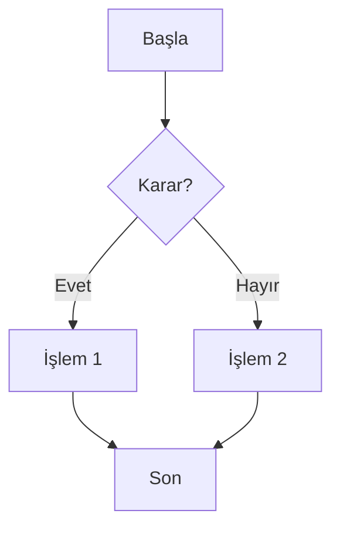
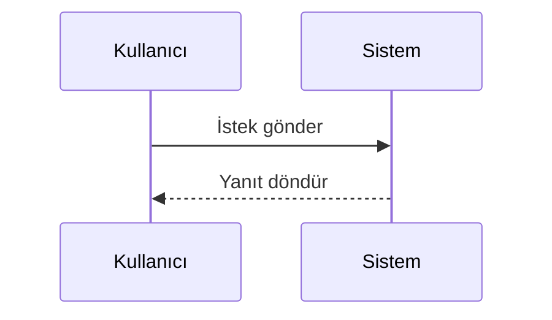
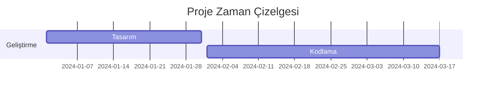

# 🎨 Mermaid Diyagram Oluşturucu

Modern ve kullanıcı dostu bir GUI ile Mermaid diyagramlarını kolayca oluşturun ve çeşitli formatlarda dışa aktarın.


## 📋 İçindekiler

- [Özellikler](#-özellikler)
- [Ekran Görüntüsü](#-ekran-görüntüsü)
- [Kurulum](#-kurulum)
- [Kullanım](#-kullanım)
- [Desteklenen Formatlar](#-desteklenen-formatlar)
- [Gereksinimler](#-gereksinimler)
- [Sorun Giderme](#-sorun-giderme)
- [Katkıda Bulunma](#-katkıda-bulunma)

## ✨ Özellikler

- 🖥️ **Modern GUI**: Temiz ve kullanıcı dostu arayüz
- 📊 **Çoklu Format Desteği**: PNG, JPG, SVG, PDF formatlarında çıktı
- 🎨 **Özelleştirilebilir**: Boyut ve arka plan rengi ayarları
- 📁 **Esnek Çıktı**: İstediğiniz dizine kaydetme
- ⚡ **Hızlı Önizleme**: Anlık kod yazma ve oluşturma
- 🔧 **Hata Yönetimi**: Detaylı hata mesajları ve çözüm önerileri

## 🖼️ Ekran Görüntüsü


## 🚀 Kurulum

### 1. Sistem Gereksinimleri

**Linux (Ubuntu/Debian/Mint):**
```bash
# Python ve pip kurulumu
sudo apt update
sudo apt install python3 python3-pip python3-tk

# Node.js ve npm kurulumu
sudo apt install nodejs npm

# Alternatif olarak Node.js'in son sürümü için:
curl -fsSL https://deb.nodesource.com/setup_lts.x | sudo -E bash -
sudo apt-get install -y nodejs
```

**Fedora/CentOS/RHEL:**
```bash
# Python kurulumu
sudo dnf install python3 python3-pip python3-tkinter

# Node.js kurulumu
sudo dnf install nodejs npm
```

**Arch Linux:**
```bash
# Python kurulumu
sudo pacman -S python python-pip tk

# Node.js kurulumu
sudo pacman -S nodejs npm
```

### 2. Mermaid CLI Kurulumu

```bash
# Global olarak Mermaid CLI'yi kurun
sudo npm install -g @mermaid-js/mermaid-cli

# Kurulumu doğrulayın
mmdc --version
```

### 3. Projeyi İndirin

```bash
# Git ile klonlayın
git clone https://github.com/kullanici-adi/mermaid-gui.git
cd mermaid-gui

# Veya dosyayı doğrudan indirin
wget https://raw.githubusercontent.com/kullanici-adi/mermaid-gui/main/mermaid_gui.py
```

### 4. Çalıştırın

```bash
python3 mermaid_gui.py
```

## 📖 Kullanım

### Temel Kullanım

1. **Mermaid Kodunu Girin**: Sol üst alandaki text kutusuna Mermaid kodunuzu yazın
2. **Dosya Adını Belirleyin**: Çıktı dosyasının adını girin (uzantısız)
3. **Format Seçin**: PNG, JPG, SVG veya PDF formatlarından birini seçin
4. **İsteğe Bağlı Ayarlar**:
   - Genişlik ve yükseklik (piksel cinsinden)
   - Arka plan rengi (transparent, #ffffff, red vb.)
   - Çıktı dizini
5. **Oluştur**: "Diyagram Oluştur" butonuna tıklayın

### Örnek Mermaid Kodları

**Akış Diyagramı:**


**Sıralama Diyagramı:**


**Gantt Şeması:**


## 📁 Desteklenen Formatlar

| Format | Uzantı | Açıklama |
|--------|--------|----------|
| PNG    | .png   | Yüksek kaliteli raster görüntü |
| JPEG   | .jpg   | Sıkıştırılmış raster görüntü |
| SVG    | .svg   | Ölçeklenebilir vektör grafik |
| PDF    | .pdf   | Belge formatı |

## ⚙️ Gereksinimler

### Yazılım Gereksinimleri

- **Python**: 3.6 veya üzeri
- **Tkinter**: Python GUI kütüphanesi (genellikle Python ile birlikte gelir)
- **Node.js**: 14.x veya üzeri
- **NPM**: Node.js paket yöneticisi
- **Mermaid CLI**: @mermaid-js/mermaid-cli

### Sistem Gereksinimleri

- **RAM**: Minimum 512 MB
- **Disk Alanı**: 100 MB (Node.js modülleri dahil)
- **İşletim Sistemi**: Linux, macOS, Windows

## 🔧 Sorun Giderme

### Yaygın Hatalar ve Çözümleri

**1. "mmdc komutu bulunamadı" Hatası**
```bash
# Mermaid CLI'nin kurulu olduğunu kontrol edin
which mmdc
mmdc --version

# Eğer kurulu değilse:
sudo npm install -g @mermaid-js/mermaid-cli

# PATH kontrolü
echo $PATH
```

**2. "tkinter modülü bulunamadı" Hatası**
```bash
# Ubuntu/Debian için:
sudo apt install python3-tk

# Fedora için:
sudo dnf install python3-tkinter
```

**3. Node.js/NPM Kurulum Sorunları**
```bash
# Node.js sürümünü kontrol edin
node --version
npm --version

# Eğer eski sürüm varsa, NodeSource deposundan kurun
curl -fsSL https://deb.nodesource.com/setup_lts.x | sudo -E bash -
sudo apt-get install -y nodejs
```

**4. İzin Sorunları**
```bash
# Çıktı dizinine yazma izni verin
chmod 755 /path/to/output/directory

# Veya ev dizinini kullanın
```

### Debug Modu

Ayrıntılı hata mesajları için uygulamayı terminal'den çalıştırın:
```bash
python3 -u mermaid_gui.py
```

## 🎯 Gelecek Özellikler

- [ ] Diyagram önizleme
- [ ] Tema desteği (koyu/açık mod)
- [ ] Toplu dönüştürme
- [ ] Şablon galerisi
- [ ] Diyagram paylaşma
- [ ] Gelişmiş düzenleme araçları

## 🤝 Katkıda Bulunma

1. Bu repository'yi fork edin
2. Feature branch oluşturun (`git checkout -b feature/YeniOzellik`)
3. Değişikliklerinizi commit edin (`git commit -am 'Yeni özellik eklendi'`)
4. Branch'inizi push edin (`git push origin feature/YeniOzellik`)
5. Pull Request oluşturun

## 📄 Lisans

Bu proje GNU General Public License v3.0 altında lisanslanmıştır. Detaylar için [LICENSE](LICENSE) dosyasına bakın.

---

**Son Güncelleme**: 28 Mayıs 2025
