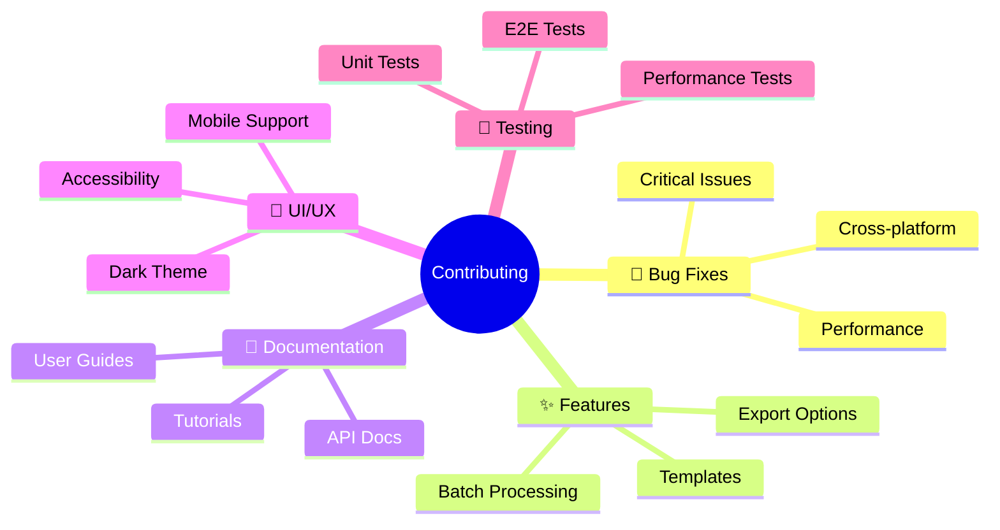

# 🌟 Contributors

**Thank you to everyone who has contributed to making Mermaid GUI v2.0 awesome! 🚀**

---

## 👨‍💻 Core Team

<table>
<tr>
    <td align="center">
        <a href="https://github.com/baris-sinapli">
            
             
            <b>Barış Sinaplı</b>
        </a>
         
        🎯 Project Creator & Maintainer
         
        💻 Architecture • 📖 Documentation • 🚀 Features
    </td>
</tr>
</table>

## 🌍 Community Heroes

<table>
<tr>
    <td align="center">
        <a href="https://github.com/Prankisster">
            
             
            <b>Prankisster</b>
        </a>
         
        🎉 First Community Contributor!
         
        🔧 .gitignore • 📝 Example Diagrams
    </td>
</tr>
</table>

---

## 🏆 Contribution Types

| Emoji | Contribution Type | Description |
|-------|------------------|-------------|
| 💻 | Code | Programming, bug fixes, features |
| 📖 | Documentation | README, guides, comments |
| 🎨 | Design | UI/UX, icons, visual improvements |
| 🐛 | Bug Reports | Finding and reporting issues |
| 💡 | Ideas | Feature suggestions, improvements |
| 🔧 | Tools | Build tools, CI/CD, development setup |
| 🌍 | Translation | Internationalization support |
| 📝 | Content | Examples, tutorials, blog posts |
| 🤔 | Review | Code review, feedback, testing |
| 📢 | Outreach | Talks, articles, promotion |

---

## 📊 Contribution Stats

**Total Contributors:** 2 • **Community Contributors:** 1 • **PRs Merged:** 2

---

## 🚀 Want to Join Our Contributors?

### 🎯 Areas We Need Help

---

## 💝 Recognition

> Every contribution, no matter how small, makes a difference. Thank you for helping make Mermaid GUI v2.0 better for everyone!

**🌟 [Contributing Guidelines](CONTRIBUTING.md) • 🎯 [Good First Issues](https://github.com/baris-sinapli/mermaid-diagram/issues?q=is%3Aissue+is%3Aopen+label%3A%22good-first-issue%22) • 💬 [Discussions](https://github.com/baris-sinapli/mermaid-diagram/discussions)**

---

Built with ❤️ by the open source community

